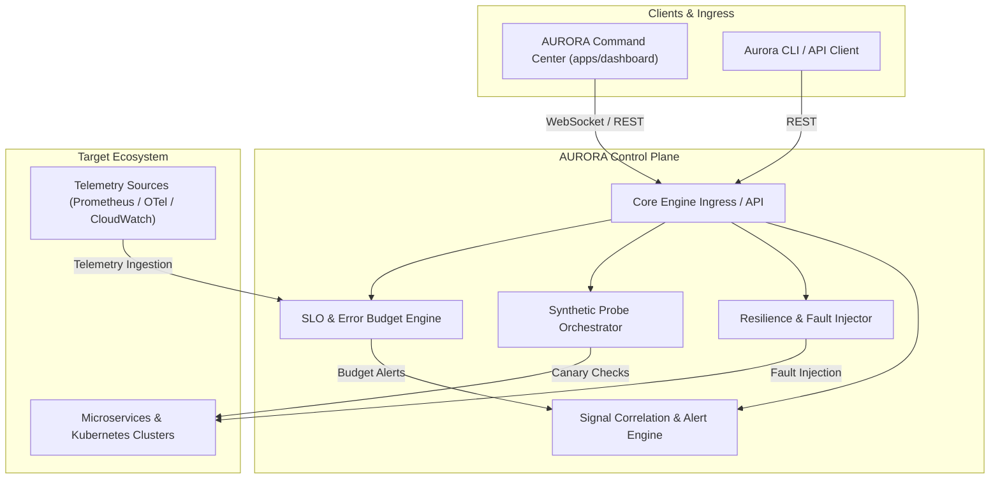

# ⚡ AURORA | Reliability Platform

[](LICENSE)
[](https://nodejs.org)
[](#architecture)
[](#key-capabilities)

> **AURORA** is a next-generation Cloud Reliability, Service Level Objective (SLO) Orchestration, and Resilience Engineering platform designed to unify synthetic canary telemetry, error budget accounting, and automated fault injection into a unified SRE command plane.

---

## 🌟 Key Capabilities

- **📊 Dynamic SLO & Error Budget Tracking**: Automated multi-window, multi-burn-rate alerting across microservices with real-time error budget consumption forecasting.
- **🛰️ Synthetic Canary & Health Probing**: High-frequency, distributed synthetic transaction probes testing real user critical paths (HTTP/gRPC/WebSocket).
- **🧪 Autonomous Resilience & Chaos Injection**: Controlled fault injection (latency, packet loss, service isolation, resource saturation) with automated rollback when error budgets breach threshold.
- **🚨 Unified Incident Signal Correlation**: Correlate anomaly spikes, degradation patterns, and telemetry signals into actionable incident contexts.
- **🖥️ Command Center UI**: Real-time reactive glassmorphic observability console tailored for SRE and on-call engineers.

---

## 🏗️ Architecture Overview



---

## 📁 Repository Layout

```
AURORA/
├── apps/
│   └── dashboard/          # AURORA Observability & SRE Command Center (React/Vite)
├── services/
│   └── engine/             # Core reliability engine, probe runners & SLO evaluators
├── packages/
│   └── types/              # Canonical shared domain models (SLOs, Probes, Chaos, Alerts)
├── docs/
│   ├── architecture/       # Detailed technical design specifications
│   └── adr/                # Architecture Decision Records (ADR)
├── .editorconfig           # Code formatting standards
├── .gitignore              # Repository exclusion rules
├── package.json            # Root workspace configuration
├── tsconfig.base.json      # Shared strict TypeScript configuration
└── README.md               # Repository documentation
```

---

## 🚀 Quick Start

### Prerequisites

- **Node.js**: `v20.0.0` or higher (verified on Node `v22.11.0`)
- **npm**: `v10.0.0` or higher

### Setup

```bash
# Clone the repository
git clone https://github.com/organization/aurora-reliability-platform.git
cd aurora-reliability-platform

# Install dependencies across all workspaces
npm install
```

### Development Modes

```bash
# Launch the Core Reliability Engine
npm run dev:engine

# Launch the AURORA Command Center Dashboard
npm run dev:dashboard
```

---

## 📖 Documentation & ADRs

- [Architecture Blueprint](docs/architecture/system-overview.md)
- [ADR-0001: Monorepo Architecture & Technology Foundation](docs/adr/0001-repository-and-architecture-foundation.md)

---

## 📜 License

Licensed under the [Apache License, Version 2.0](LICENSE).
